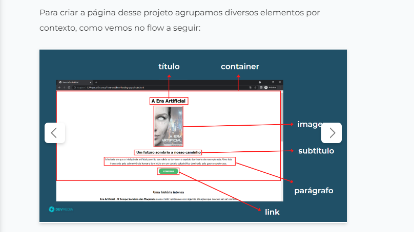

# page_for_book_amazon-project

______________________________

 ## Pagina para um livro

 ________________________

Neste projeto foi desenvolvido uma pagina web, responsiva, com um link que leva direto para a pagina para comprar o livro na amazon.
  
In this project, a responsive web page was developed, with a link that takes you directly to the page to buy the book on amazon.

 ## Descrição em Português

_________________________
  Este projeto foi baseado em um layout entregue no projeto passo a passo na plataforma de ensino DevMedia, O formato Passo a passo  funciona da seguinte forma, é passado uma imagens do Produto final e em seguinte tem passos a serem conquistados com cards com pequenas descrições do que deve ser feito, sem muitos detalhes sobre o código com o incentivo para que o estudante crie o próprio código, o objetivo e chegar ao mesmo resultado ao final  
  O projeto veio sem imagens de fundo, eu coloquei as imagens e modifiquei o posicionamento de alguns elementos na tela. Deixando o projeto como proprio, por ser um design Feito por mim.

  ## Description in English

  _________________________
This project was based on a layout delivered in the step-by-step project on the DevMedia teaching platform. that must be done, without much detail about the code with the incentive for the student to create their own code, the objective and to reach the same result in the end  
The project came without background images, I placed the images and modified the placement of some elements on the screen. Leaving the project as its own, as it is a design Made by me.

 Na imagem acima, temos um exemplo de como são os Cards explicativo

  

  ### Technologies used:

  HTML5 / CSS3
